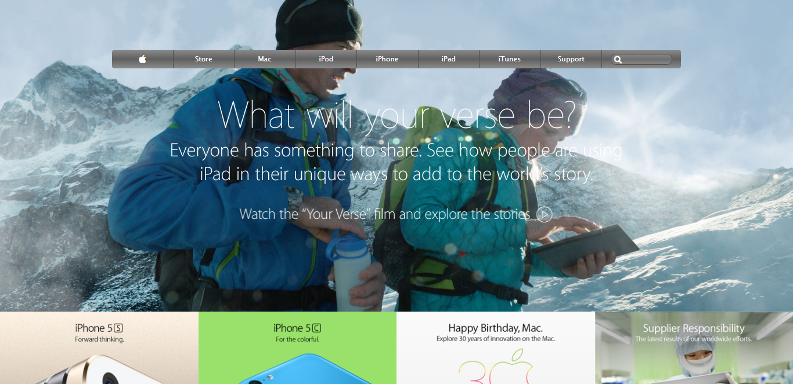

# Old-Apple-Website-Clone
> This project consists of building a webpage using images as a background and adding gradients to elements. The goal is to make a clone of old an old version of the [Apple website webpage](https://web.archive.org/web/20140301004610/http://www.apple.com/).



## Project Requirements

### General
- You can find the original project specification at [The Odin Project](https://www.theodinproject.com/courses/html5-andcss3/lessons/building-with-backgrounds-and-gradients).

### Specific to Microverse
- Align all elements with ```float``` and ```flex``` or ```grid```.
- The CSS background should cover the whole page irrespective of the screen size. This is a learning opportunity for you to use the background size and position properties.

## Built With

- HTML
- CSS

## Dependencies

> Refer to [Linters Config](https://github.com/eananti/linters-config/tree/master/html-css) for project setup guide.

## Live Demo

[Live Demo Link](https://ceejayski.github.io/Old-Apple-Website-Clone/)

## Authors

👤 **Author1**

- Github: [@eananti](https://github.com/eananti)
- Twitter: [@e_ananti](https://twitter.com/e_ananti)
- Linkedin: [Emeka Ananti](https://www.linkedin.com/in/emekaananti/)

👤 **Author2**

- Github: [@Ceejayski](https://github.com/ceejayski)
- Twitter: [@Ceejaski1](https://twitter.com/Ceejayski1)
- Linkedin: [Okoli Chijioke](https://www.linkedin.com/in/okolichijioke/)

## Show your support

Give a ⭐️ if you like this project!
